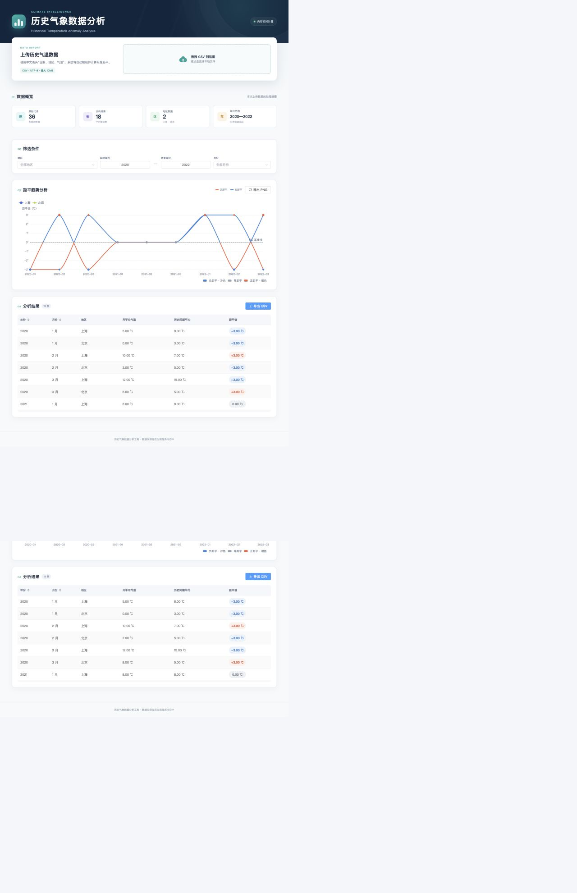
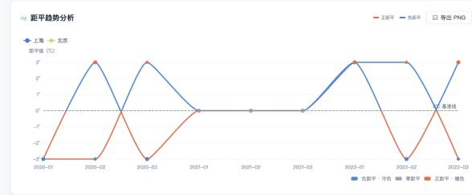
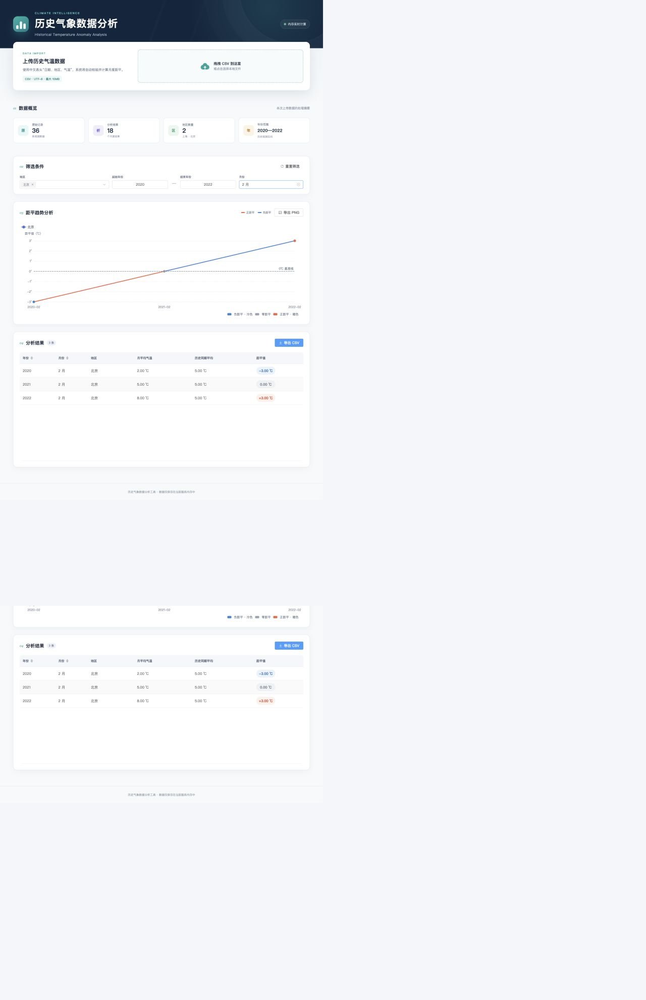
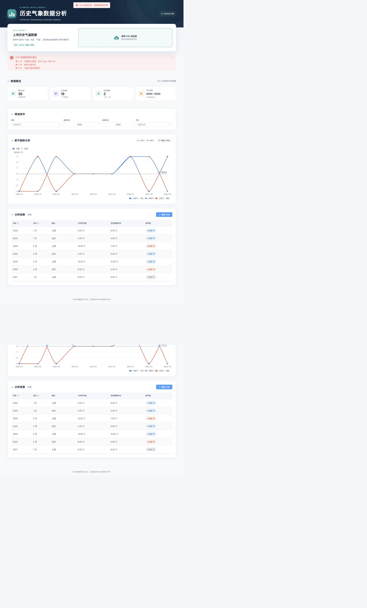

# 历史气象数据分析工具

一个前后端分离的历史气温分析原型。上传符合格式的 CSV 后，系统会在内存中完成数据校验、月平均气温、历史同期平均气温和距平计算，并提供多条件筛选、趋势图、结果表格以及 CSV/PNG 导出。

项目面向限时技术面试场景：保持结构清晰、业务规则可解释，不使用数据库、登录鉴权、微服务或复杂状态管理。

## 功能

- 上传 UTF-8 或 UTF-8 BOM 编码的中文表头 CSV
- 文件级与行级校验，一次展示多条具体错误
- 使用 `BigDecimal` 完成月平均、历史同期平均和距平计算
- 对低于 -80℃ 或高于 60℃ 的记录进行非阻断式异常提示
- 按多地区、年份范围和月份筛选
- Element Plus 表格展示完整分析结果
- ECharts 多地区趋势图及 0℃ 基准线
- 正距平使用暖色、负距平使用冷色，地区通过 legend、symbol 和 tooltip 区分
- 按当前筛选条件导出 CSV
- 浏览器端导出趋势图 PNG
- 新数据上传成功后自动重新计算并刷新页面
- 响应式布局、空数据状态、加载状态和统一错误提示

## 技术栈

后端：

- Java 17
- Spring Boot 3.5
- Spring Web / Spring Validation
- Apache Commons CSV
- Maven

前端：

- Vue 3 + TypeScript
- Vite
- Element Plus
- Axios
- Apache ECharts

数据只存放在服务端内存中。每次成功上传会完整替换旧数据；上传校验失败不会改变当前数据。

## 环境要求

- JDK 17+
- Maven 3.9+
- Node.js 18+（推荐 Node.js 20 LTS）
- npm 9+

## 快速启动

启动后端：

```bash
cd backend
mvn spring-boot:run
```

启动前端：

```bash
cd frontend
npm install
npm run dev
```

浏览器访问 [http://localhost:5173](http://localhost:5173)。Vite 会把 `/api` 请求代理至 `http://localhost:8080`。

## CSV 格式

第一行必须包含中文表头：

```csv
日期,地区,气温
2020-01-15,北京,2.5
2020-01-20,北京,3.1
```

- 日期：严格使用 `yyyy-MM-dd`
- 地区：非空字符串
- 气温：可解析为数字
- 编码：UTF-8 或 UTF-8 BOM
- 文件大小：不超过 10MB

可直接使用 [正确样例](sample/weather.csv) 演示完整流程，使用 [错误样例](sample/invalid-weather.csv) 演示多行校验提示。

## 核心计算规则

```text
月平均气温 = 同一地区、同一年、同一月份的所有原始气温平均值

历史同期平均气温 = 同一地区、同一月份的所有“年月平均气温”再次求平均

距平值 = 当年月平均气温 - 历史同期平均气温
```

历史同期平均并非直接混合所有原始记录求平均。例如，北京 2020 年 1 月月平均为 `2.80`，2021 年 1 月月平均为 `2.10`，则历史同期平均为 `(2.80 + 2.10) / 2 = 2.45`，两年的距平分别为 `+0.35` 和 `-0.35`。

后端内部使用 `BigDecimal` 并保留较高计算精度，除法采用 `RoundingMode.HALF_UP`；API 展示和 CSV 导出保留两位小数。筛选只过滤已经完成的结果，不会改变基于本次上传全量数据计算出的历史同期基准。

## API

| 方法 | 地址 | 说明 |
| --- | --- | --- |
| `POST` | `/api/weather/upload` | multipart 上传，字段名为 `file`；校验、计算并替换内存数据 |
| `GET` | `/api/weather/metadata` | 获取记录数、地区、年份、月份、异常值等元数据 |
| `GET` | `/api/weather/results` | 获取筛选后的分析结果 |
| `GET` | `/api/weather/export` | 按相同筛选条件导出带 UTF-8 BOM 的中文 CSV |

结果与导出接口支持以下可选 Query 参数：

- `regions=北京,上海`：一个或多个地区
- `startYear=2020`：起始年份
- `endYear=2024`：结束年份
- `month=1`：月份，范围 1–12

普通 JSON 接口统一响应：

```json
{
  "success": true,
  "message": "success",
  "data": {}
}
```

校验失败返回 HTTP 400，`message` 中包含行号和具体原因；文件下载接口直接返回 CSV 文件。

## 项目结构

```text
.
├── backend/
│   ├── pom.xml
│   └── src/
│       ├── main/java/com/example/weather/
│       │   ├── controller/    # REST API
│       │   ├── service/       # 聚合、筛选与导出
│       │   ├── util/          # CSV 解析和校验
│       │   ├── store/         # 原子内存快照
│       │   ├── model/、dto/   # 数据模型与响应类型
│       │   └── exception/     # 统一异常处理
│       └── test/              # 业务、解析和 API 测试
├── frontend/
│   └── src/
│       ├── api/               # Axios API 封装
│       ├── components/        # 上传、筛选、统计、图表、表格
│       ├── types/             # TypeScript 类型
│       ├── styles/            # 页面样式与响应式规则
│       └── App.vue            # 单页状态和数据流
├── sample/                    # 正确和错误 CSV 样例
└── docs/screenshots/          # 实际运行截图
```

核心算法位于 `WeatherAnalysisService`：先生成“地区 + 年份 + 月份”月平均，再生成“地区 + 月份”历史同期平均，最后相减得到距平。`CsvParser` 负责 BOM、表头和行级校验；`WeatherDataStore` 通过原子不可变快照保证成功后一次性替换。

## 测试与构建

后端：

```bash
cd backend
mvn test
mvn package
```

前端：

```bash
cd frontend
npm install
npm run build
```

测试优先证明核心业务计算、CSV 校验和 API 行为正确。功能完整性、正确计算、项目可运行及本文档优先于追求额外覆盖率。

## 演示截图

### CSV 上传成功后的完整页面



### 多地区距平趋势图



### 筛选后的分析结果



### 错误 CSV 校验提示



## 演示流程

1. 启动后端和前端，访问 `http://localhost:5173`。
2. 上传 `sample/weather.csv`，确认统计信息、两地区趋势图和结果表格自动出现。
3. 选择“北京 + 上海”，观察不同 symbol 以及暖色正距平、冷色负距平。
4. 调整年份范围或月份，确认图表和表格同步变化。
5. 分别点击“导出 CSV”和“导出 PNG”。
6. 上传 `sample/invalid-weather.csv`，确认页面保留旧数据并展示多条带行号的错误。

## AI 辅助开发说明

本项目使用 AI 辅助生成和完善了部分重复性及框架性代码，包括：

- Spring Boot Controller、DTO、统一响应和异常处理基础结构
- Apache Commons CSV 读取、UTF-8 BOM 处理和行级校验代码
- Vue 3 + Element Plus 单页组件基础结构与响应式样式
- ECharts series、piecewise visualMap、tooltip 和 PNG 导出配置
- Axios Blob 下载辅助代码及测试样板

这些代码均围绕题目约束进行了检查、构建和实际运行验证。对核心业务的理解如下：

1. 原始记录不能直接用于历史同期平均，必须先按地区、年份、月份生成每年月平均。
2. 再按地区和月份平均所有年份的月平均值，才能保证不同年份权重一致。
3. 当年月平均减去对应的历史同期平均即为距平；正值代表偏暖，负值代表偏冷。
4. 筛选发生在计算完成之后，因此不会因选择年份范围而改变历史基准。

## 限制

- 数据只保存在单个后端进程内存中，重启服务后清空。
- 新上传成功时覆盖旧数据，不提供多用户隔离和历史版本。
- 原型未实现分页；适合面试演示和中小型 CSV，不作为大数据生产方案。
